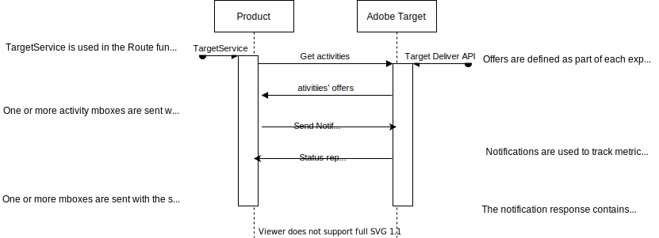

# pss-adobe-target

This module is a wrapper around the Adobe Target Node SDK. The module exports two constructors for use by products. One creates an express router with routes defined to get Adobe Target activities and to send notifications to Adobe Target. The other contructor creates a service that can be used to get activities or send notifications in a couple of ways, with middleware or calling  functions directly.



## Installation

In the server directory of a product run:

```npm i -P @pss/pss-adobe-target```

## Configuration

Both the pss-adobe-target Router and Service expect the follow configuration at initialization.

```javascript
const pssAdobeTargetRouter = PssAdobeTarget.Router(adobeTargetConfig, PssLogger);
const pssAdobeTargetService = PssAdobeTarget.Service(adobeTargetConfig, PssLogger);
```

### pss-adobe-target configuration

```json
{
  "client": "vault_adobe_target_client",
  "organizationId": "vault_adobe_target_org_id",
  "propertyToken": "vault_adobe_target_property",
  "decisioningMethod": "on-device",
  "events": {
    "clientReady": onTargetClientReady,
    "artifactDownloadSucceeded": onArtifactDownloadSucceeded,
    "artifactDownloadFailed": onArtifactDownloadFailed,
  },
  "timeout": 500
}
```


For more information about the Adobe Target SDK configuration see this website: <https://adobetarget-sdks.gitbook.io/docs/sdk-reference-guides/nodejs-sdk/initialize-sdk>.

| attribute | required | type | expected value | secret | description |
| --------- | -------- | ---- | --------------- | ------ | ----------- |
| `client` | yes | string | `vault_adobe_target_client` | yes | The Adobe Target client code. This value will be replaced with a secret from vault. |
| `organizationId` | yes | string | `vault_adobe_target_org_id` | yes | The Adobe Tartet IMS Id. The value will be replaced with a secret from vault | 
| `propertyToken` | yes | string | `vault_adobe_target_property` | yes | The Adobe Target environment property. The value will be replaced with a secret from vault. | 
| `decisioningMethod` | no | string | `on-device`, `server-side`, or `hybrid` | no | Determines the decisioning method to use | 
| `events` | no | object | see below | no | An optional object with event name keys and callback function values |
| `timeout` | no | number | Timeout in milleseconds | no | The timeout value for all requests to Adobe Target. | 

### Events

These event functions will be defined either in code before initializing pss-adobe-target or in the configuration file. For more information about the Adobe Target SDK events see this website: <https://adobetarget-sdks.gitbook.io/docs/sdk-reference-guides/nodejs-sdk/sdk-events>.

| attribute | required | type | description |
| --------- | -------- | ---- | ----------- |
| `clientReady` | no | function | Emitted when the artifact has downloaded and the SDK is ready for getOffers calls. Recommended when using on-device decisioning method. |
| `artifactDownloadSucceeded` | no | function | Emitted each time a new artifact is downloaded. |
| `artifactDownloadFailed` | no | function | Emitted each time an artifact fails to download. |


### PssLogger

This is an initialized PssLogger that will be passed into both the Router and Service.

```javascript
const PssLogger = require("@pss/pss-logger")(config.loggingConfig);
```

## Exports

pss-adobe-target exports two constructors, one for an express Router and one for a Service.

### Routes

The pss-adobe-target Router sets up two routes for use in client-side ajax requests.

GET /target/activity?activity=value1&activity=value2

This route fetches one or more experience the current user is in as well as the offer delivered by those experiences. The route expects one or more activity query parameters. The activity parameter is the main mbox of the adobe target activity defined when creating the activity in Adobe Target.

PUT /target/notification?mbox=mbox1&mbox=mbox2

This route will send notifications to adobe target for one or more mboxes. The route expects one or more mbox query parameters. The mboxes correspond to the metrics setup when creating the activity in Adobe Target. This is how we will collect success metrics for server-side activities.


## Usage

### As a router

PssAdobeTarget.Router() returns an express router.

The router will mainly be used for hybrid and server-side decisioning based activities. In the main node server javascript file, usually ```app.js``` in pss products, import pss-adobe-target.

Initialize the pss adobe target router and use it.

```javascript
const app = express();

...

const PssLogger = require("@pss/pss-logger")(config.loggingConfig);
const PssAdobeTarget = require("@pss/pss-adobe-target");
...

const pssAdobeTargetRouter = PssAdobeTarget.Router(config.adobeTargetConfig, PssLogger);
app.use(pssAdobeTargetRouter);
```

#### GET /target/activity
From client-side javascript send ajax requests to fetch which experience the current user is in and the offer delivered by the experience.

The ```/target/activity``` route expects one or more ```activity=some-mbox-here``` query parameter.


```javascript
const activityName = "statdx-hsearch";

$.ajax("/target/activity?activity=" + activityName).done(function(response) {
    const statdxHsearchActivity = response[activityName];

    // Do something with the feature flag returned by the activity.
});
```

The response will be an object with a key of each activity requested with the value of the offers defined for the requested activities. The best practice should be to define the offer as a feature flag object that will be overrided based on which experience the user is currently in.
Here is a sample response for the ```/target/activity?activity=statdx-hsearch``` route
```json
{
  "statdx-hsearch": {
    "active": true,
    "variation": "control",
    "payload": {
      "searchIndex": 0
    }
  }
}
```

#### PUT /target/notification

From client-side javascript send ajax requests to trigger events for currently running server-side activities.

The ```/target/notification``` route expects one or more ```mbox=some-mbox-here``` query parameter.

```javascript
const mbox = "mbox server-side-success";

$.ajax({
    url: "/target/notification?mbox=" + mbox,
    type: "PUT"
}).done(function(response) {
    // do something with the response
});
```

Here is an example of the notification route response object

```json
{
  "status": 200,
  "requestId": "7d62c85c07fc4fe3a4622a0f847903ce",
  "id": {
    "tntId": "67664e186ef54ffd9cb60b20ef66aceb.35_0"
  }
}
```

### As middleware

PssAdobeTarget.Service() returns an object with a number of functions for use interacting with adobe target. Among these function are two middleware methods that will add a function to the request to fetch activities or send notifications.

First initialize the Service

```javascript
const PssLogger = require("@pss/pss-logger")(config.loggingConfig);
const PssAdobeTarget = require("@pss/pss-adobe-target");
...

const pssAdobeTargetService = PssAdobeTarget.Service(config.adobeTargetConfig, PssLogger);
```

Then use the middleware on routes defined in the product. 

The ```Middleware.getActivities``` expects one or more ```activity=activity-box``` query paramenter.

The ```Middleware.sendNotification``` expects one or more ```mbox=mbox-name``` query paramenter.

```javascript
    app.get("/test/target/activity",
        targetService.Middleware.getActivities,
        (req, res, next) => {
            const activities = req.getTargetActivities();
            const searchEndpoint = activities["statdx-hsearch"];
            
            let features = req.session.features;
            features["statdx-hsearch"] = searchEndpoint;
            
            req.session.save(() => {
                
                if (features["statdx-hsearch"].variation === "contol") {
                    // show the control experience
                } else if (features["statdx-hsearch"].variation === "variation") {
                    // show the variation experience
                } else {
                    // show the default experience
                }
                
                ... // code continues
            });
        });


    app.get("/test/target/notification",
        targetService.Middleware.sendNotification,
        (req, res, next) => {
            const activities = req.getTargetActivities();
            
            const notificationResponse = req.getTargetNotificationResponse();
            if (notificationResponse.status !== 200) {
                // Do something if the notification failed to send
            }
        });
```

### In code

The Service exports functions that can be used in nodejs code to interact with adobe target

```javascript

const targetService = PssAdobeTarget.Service(adobeTargetConfig, PssLogger);

const renderSomePage = (req, res, next) => {
    
    ...
    
    targetService.getActivities(["show-some-feature"])
        .then(response => {
            logger.trace("Get activity response = ");
            logger.trace(response);
            
            const showSomeFeature = response["show-some-feature"];
            req.session.features["show-some-feature"] = showSomeFeature;
            
            req.session.save(() => {
                res.render("/some/page", {
                    showVariation: req.session.features["show-some-feature"].variation === "variation"
                });    
            });
            
        })
        .catch(error => {
            logger.error("Failed to get activities");
            logger.error(error);
            res.render("/error/page");
        });
};

```

